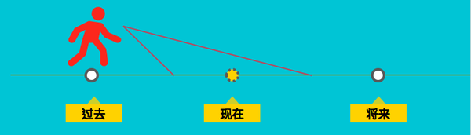

# 时态

探讨`时态`和`谓语动词`之间的关系。抽丝剥茧，将传统的`时态`一分为二，从动词的`态`和`时`，深刻了解`英语时态`的本质。

## 1. 中文和英文的`时态`差异

`时态`在中文里是通过`时间状语`来体现的，而英语则是通过`谓语动词`体现的。

- 例如，中文：  
    - “我昨天 跑步”  
    - “我 跑步”  
    - “我明天 跑步”  
    
我们是通过时间状语了解时态的，以上三句话中的动词`跑步`没有发生任何变化。

- 然而，英语：  
    - I ran yesterday  
    - I run  
    - I will run tomorrow  
    
英语即使没有时间状语，也可以通过谓语动词清楚的看出背景时间是`昨天`、`现在`还是`将来`。

所以可以总结出：**英语是通过谓语动词来体现动作的`时间`和`状态`的。（请默念十遍）**

- **这里隐含了谓语动词两个重要的属性**：  
    1. 动作的`状态`，即`态`。也就是表明了是“正在跑”、“跑完了”还是“持续跑”。  
    2. 动作的`时间`，即`时`。也就是表明了“现在正在跑”，“过去已经跑完了”还是“过去一直持续跑”。  

这是英语和中文的本质区别之一。在我们的母语里，时间不是由谓语动词来表现的，所以这是我们觉得`时态`难的根本原因。 

## 2. 动词的5个`态`

以动词`write`为例，`write`为其原型（base form）。此时，动词原型`write`只表现了`写`这个概念，但是既没有`态`也没有`时`的意义。

那么为了使其变形成为具有**时态概念**的谓语动词，我们需要给它穿两件衣服。第一件衣服就是`态`，动词有以下5种`态`，表明动作的`状态`：  

态 | 动词形式 | 说明
:-- | :-- | :--
**不定态**(infinitives) | `to write` | **要写，但是还没有写**，表现了一种**不确定**的状态， 例如`I want to write`，表明了意愿，但是`写`这个动作还没有发生  
**进行态**(gerunds) | `writing` | **正在写**，强调`写`这个动作**正在发生**，可以理解为`不定态`的下一步，即由`要写，但还没有写`发展成了`正在写`，强调**正在**，但它不是一种常态  
**完成态**(participles) | `written` | **写完了**，强调`写`这个动作**已经完成**，强调**完成**。同样，这似乎可以理解为`进行态writing`的下一步，即由`正在写`发展为`写完了`  
**一般态** | `write` | **经常写**，强调`写`这个动作是一种常态。可以理解为上面3种态的全部，而且是经常发生的动作。比如`I write a lot` 表明了我经常写作，是一种常态  
**完成进行态** | `been writing` | **已经完成，但是还将持续下去**，可以理解为`完成态`和`一般态`的一种结合。比如我的<<英语私房课>>系列文章的刊登，这一篇文章已经完成，不过后续文章还会陆续分享给大家，这个动作还将继续持续下去，这就是一个完成进行态的例子  

动词原形（base form）穿完第1层**态**的衣服之后，就赋予了**动作**不同的**状态**，这是动词原形的**五种非谓语动词**。

动词**write**可以有`正在写`，`写完了`等不同的**状态**，这比原形**write**本身已经丰富很多，  

可这五种非谓语动词虽表明了动作的**状态**，但是依然没有**时间**的意义，比如`进行式(writing)`，虽然我们可以了解`写`的动作`正在发生`，但是我们并不能知道是`过去正在发生`，还是`现在正在发生`，或是`将来正在发生`。  

要赋予非谓语动词**时间**的意义，我们就要给它穿上第2层衣服，使其变成真正的**谓语动词**。  

## 3. 非谓语动词的4个`时`

自然而然，我们将时间轴分为三个部分，即`过去`、`现在`和`将来`。  

- 英语中还有一种可能，就是站在过去的某个时间点去预测将来，即`过去将来时`。比如:
    - 我**3年前**预计我**5年后**一定会有8块腹肌
    - **上周**有人预测**未来5年**房价一定会涨

这都是在**过去**谈论**将来**的例子，也就是下图所标示的情景：

## 4. 16个时态

那么由以上的`4`个**时间**和`5`个**状态**的排列组合，就自然而然的形成了英语中的**16个时态**，如下图：

> 注：由于`不定式`不能变换成普通意义上的谓语动词，所以这里省略去。

时态 | 不定态 | 进行态 | 完成态 | 一般态 | 完成进行态
:-- | :-- | :-- | :-- | :-- | :--
**过去** |  | `was/ware + writing` | `had + written` | `did + write` | `had + been writing`
**现在** |  | `am/is/are + writing` | `have/has + written` | `dose/do + write` | `have/has + been writing`
**将来** |  | `will be + writing` | `will have + written` | `will + write` | `will have + been writing`
**过去将来** |  | `would be + writing` | `would have + written` | `would + write` | `would have + been writing`

时态 | **过去** | **现在** | **将来** | **过去将来**
:-- | :-- | :-- | :-- | :--
**不定态** | | | |
**进行态** | `was/ware + writing` | `am/is/are + writing` | `will be + writing` | `would be + writing`
**完成态** | `had + written` | `have/has + written` | `will have + written` | `would have + written`
**一般态** | `did + write` | `dose/do + write` | `will + write` | `would + write`
**完成进行态** | `had + been writing` | `have/has + been writing` | `will have + been writing` | `would have + been writing`

上面说过，谓语动词有**时间**和**状态**两个属性，所以谓语动词的结构也由`时间 ＋ 动作状态`构成。

上图中的`＋`之前的**助动词**突出了动作的`时间`，`＋` 之后的**非谓语动词**则突出了动作的`状态`。

这种通过将谓语动词抽丝剥茧拆成：`时间 ＋ 动作状态`的方式，一方面帮助我们了解时态的本质，也可以使我们毫不费力的记住时态的16种形式。

## 5. 16个时态的进一步理解

上面的梳理建立了时态的基础知识，现在我们就以**动作状态**为基准，来更近一步了解这16个时态的用法。

### 5.1 一般态

和其他4个动作状态不同，`一般态`强调动作的**常态性**。而**不定态**、**进行态**、**完成态**以及**完成进行态**都不是动作的常态。

- 比如，关于动作`run`：  
    - `不定态`：He wants to run. 想跑还没跑    
    - `进行态`：He is running. 正在跑  
    - `完成态`：He has run. 跑完了  

以上3个都只是`run`这个动作的某一个方面，它们各自都不能构成一个**常态**。而**常态**可以理解为是包含了以上**3个状态**的全部动作的一个状态，比如**他天天在跑步**就是一个常态。  

根据常态在时间轴上的位置，我们选取不同的**时间**：

- `一般过去时`
    - He drove to work. 他以前开车上班
    - 表示现在已经不开车上班了  
- `一般现在时`
    - He drives to work. 他开车上班
    - 表示日常行为，是常态  
- `一般将来时`
    - He will drive to work. 他将会开车上班
    - 强调未来的常态  

可以看到`一般过去时`常常有**现在不是这样的**意思，基于这个理由，不变的客观规律，常常都用`一般现在时`来表达，例如:

- Plants need sun to grow.  
- The earth moves around the sun.  

- `一般过去将来时`：表示说话的人站在过去的某个时刻推测将来，例如：
    - He said he would come to see me.  
    - 谓语动词`said`表明He是在过去说的，不管`come`这个动作是在**现在**之前或之后发生，从句都应该用`一般过去将来时`。

### 5.2 进行态

前面说过，`进行态`强调动作**正在发生**。根据动作发生的时间，我们采用不同的**时间**：

- `过去进行时`：He was having a meeting when I called him. 
- `现在进行时`：He is having a meeting now.
- `将来进行时`：He will be having a meeting when I make the call. 
- `过去将来进行时`：He said that he could not come because he would be having a meeting. 

可以看出`进行态`的4种**时态**差别不大，需要注意的是，由于`进行态`的动作的时间范围往往都比较短，所以一般会清楚的指出时间（上句中划横线的部分）。

### 5.3 完成态

#### 5.3.1 现在完成时

`现在完成时`是最容易和`一般过去时`混淆的时态，首先是因为它们都可以描述过去的某个时间点。  
 
- I did the laundry (yesterday).  
- I've done the laundry.  

这两句话的最大差异就是，`一般过去时`没有说清楚事情是不是完成了，但是`现在完成时`很清楚的说明事情做完了。  

所以，当我们说过去发生的某一件事情的时候，我们要根据说话的重点是**事情发生的时间**还是**事情确定完成**来确定用什么时态，如果重点在于时间，那么我们要用`一般过去时`，当我不关心时间，关心事情的结果或者事情对现在的影响的时候，就用`现在完成时`。让焦点回到事件本身，再看一个例子：

- `一般过去时`：I lost my wallet.  
    - 只是强调我掉了钱包，没什么别的意思。  

- `现在完成时`：I've lost my wallet.   
    - 我丢了钱包，我没钱了，你能给点钱吗？  
    - 我丢了钱包，所以我现在要去取钱，不能和你吃饭了。  
    - 我丢了钱包，所以我妈骂了我一顿....  

更近一步，`现在完成时`描述的动作往往并不持续，结束了就结束了。而有时候我们需要强调动作的持续性，比如**我在微软工作10年了**。如果你想强调自己还要持续的做下去，那么这个时候就可以不用`现在完成时`，转而用`现在完成进行时`：`I have been working at Microsoft for 10 years.`

再举个细节的例子：

- `现在完成时`：I have been single for five years.   
    - 解释：  
        - 单身5年，我想恋爱了，"我受不了单身了"。  
        - 你看我好惨，单身狗当了5年了，没事约约我啊！  

- `现在完成进行时`：I have been being single for five years.   
    - 解释：  
        - 我很享受单身，而且这个状态还会继续持续。  
        - 单身狗当了5年，我觉得还会继续下去吧。  

**请认真体会一下这两者的不同。**
 
#### 5.3.2 过去完成时

`过去完成时`用来描述在**过去的过去**发生的动作，那么你只要记住`过去完成时`总有一个对应`一般过去时`，只要是在这个`一般过去时`之前完成的动作，该动作就要用`过去完成时`。

- He had studied English before he came to the US. 
    - 解释：学习发生在came之前，came本身时过去的动作，所以study用`过去完成时`。

- It had already snowed before Monday.
    - Monday是过去的时间，snow在Monday之前，因此用`过去完成时`。

同理，如果我们要强调**过去的过去**动作的连续性，即动作从**过去的过去**开始一直连续到过去的这一个时间，我们可以采用`过去完成进行时`：

- I had been watching TV before you called me.
    - 解释：强调`看电视`延续性到了called me之前。

- He had been driving all day before he went to sleep.
    - 解释：同样强调延续性。

#### 5.3.3 将来完成时

`将来完成时`从`时间 ＋ 动作状态`的角度理解，就表示在将来某一时间之前就能完成的动作。

- By the end of this month he will have trained 600 horses.
    - 解释：到这个月底，他就训练了600匹马了。

和`现在完成时`的情况类似，如果近一步讲，我们要强调动作的连续性，即在将来某一时刻之后还将持续下去，我们更倾向于用`将来完成进行时`，即:

- By the end of this month he will have been training horses for twenty years.  
    - 解释：和上一句的区别在于，这句话并没有强调在将来的时间点上，他训练了匹马的数目，也就是没有强调动作对将来时间点的影响。相反，这句话的更多的表示他还将持续training这个动作，因此用`将来完成进行时`更好。
 
#### 5.3.4 过去将来完成时

`过去将来完成时`常常应用在虚拟语气中。当应用在虚拟语气中的时候，常常陈述和事实相反的状态，例如：
 
- If I had left sooner, I would have been on time.
    - 解释：真实情况是我迟到了。
 
那么这句话为什么不说成：`If I left sooner, I would be on time`. 这是因为英语在陈述一个和事实相反的假设的时候，为了注重逻辑，不能说的似乎和真的一样，因此**为了和真实的时态做区隔，就将假设语态往过去推了一格**。
 
- **错误**: If I left sooner, I would be on time. `对过去的假设`
- 为了和真实的时态区隔，把假设语态往过去推一格，就变成了:  
    - **正确**: If I have left sooner, I would have been on time.
 
- **错误**: If I am you, I will be rich. `对现在的假设`  
- 同样，为了区隔，将时态往前推一格，变成:  
    - **正确**: If I were you, I would be rich.

### 5.4 完成进行态

- `过去完成进行时`见上面对`过去完成时`的解释，二者可合并理解。  
- `现在完成进行时`见上面对`现在完成时`的解释，二者可合并理解。   
- `将来完成进行时`见上面对`将来完成时`的解释，二者可合并理解。   
- `过去将来完成进行时`和`过去将来完成时`相通，二者可以合并理解。  
 
16种时态中，`过去将来完成进行时`是非常不常用的一个时态，但是并不难理解。和`过去将来完成时`相比，`过去将来完成进行时`依然强调持续的特性。

- `过去将来完成时`：I knew by September he would have worked here for 30 years.   
    - 解释：强调结果。

- 过去将来完成进行时`：I knew by September he would have been working here for 30 years.   
    - 解释：强调持续性。

自此总结了英语16个时态的本质和用法。
